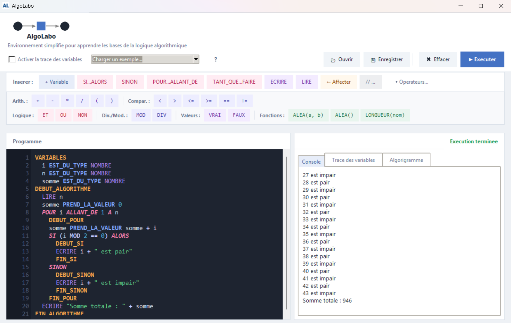
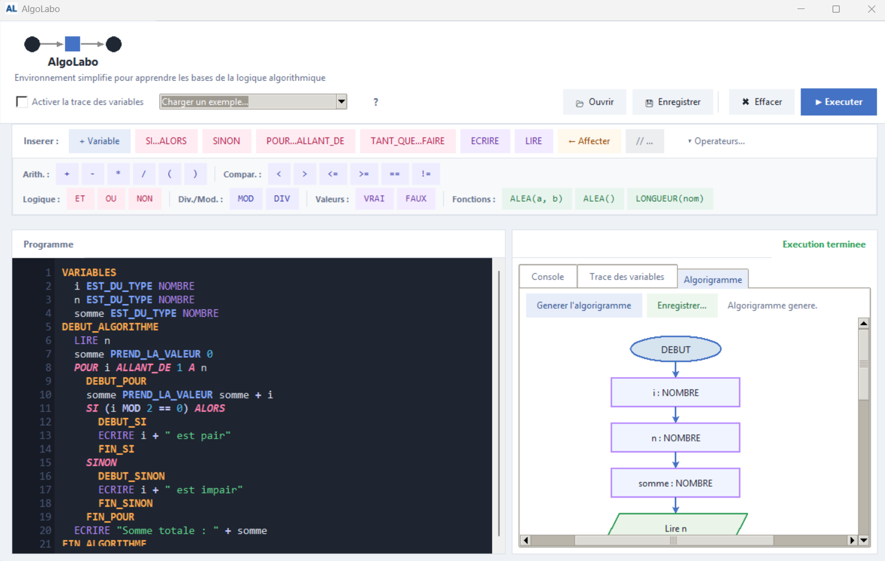
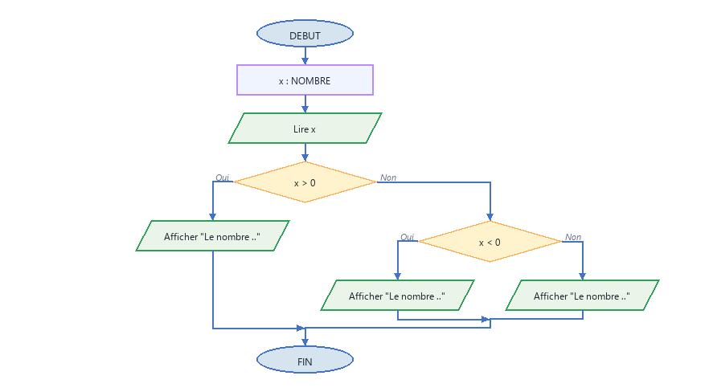

# AlgoLabo

Interpréteur pédagogique de pseudo-code avec génération d'algorigrammes, développé pour les classes de BTS CIEL IR et STI2D du Lycée EME à Marseille.

**Sans installation, sans dépendance** - un seul fichier Python ou un `.exe` prêt à l'emploi.







---

## Fonctionnalités

- **Éditeur de pseudo-code** avec coloration syntaxique et numéros de ligne
- **Exécution pas à pas** avec affichage des résultats et saisie interactive (`LIRE`)
- **Génération d'algorigramme** automatique depuis le code
- **Export PNG** de l'algorigramme complet (diagramme entier, pas seulement la zone visible)
- **Commentaires** avec `//`
- **Barre de snippets** pour insérer rapidement les structures (SI, TANT QUE, POUR…)
- **Exemples** inclus

## Langage supporté

```
ALGORITHME nom
VARIABLES
  x : ENTIER
  message : TEXTE
  t : TABLEAU[10] D'ENTIERS

DEBUT
  LIRE x
  SI x > 0 ALORS
    ECRIRE "Positif"
  SINON
    ECRIRE "Negatif ou nul"
  FIN SI

  POUR i ← 1 A 10 FAIRE
    t[i] ← i * 2
  FIN POUR

  TANT QUE x < 100 FAIRE
    x ← x * 2
  FIN TANT QUE
FIN
```

Types : `ENTIER`, `REEL`, `TEXTE`, `BOOLEEN`, `TABLEAU[n] D'ENTIERS` (et variantes)  
Opérateurs : `+` `-` `*` `/` `DIV` `MOD` - `<` `>` `<=` `>=` `=` `≠` - `ET` `OU` `NON`  
Fonctions : `ALEA()`, `ALEA(a, b)`, `LONGUEUR(tableau)`

## Installation

### Option 1 - Exécutable Windows (aucun Python requis)

Télécharger `AlgoLabo.exe` depuis la page [Releases](../../releases) et double-cliquer.

### Option 2 - Python

```bash
# Python 3.8+ requis
# Pillow optionnel (uniquement pour l'export PNG)
pip install pillow

python algolabo.py
```

## Lancer les tests du moteur

```bash
python tests/test_engine.py
```

## Structure du projet

```
AlgoLabo/
├── algolabo.py           # Point d'entree principal
├── app.py                # Interface graphique (AlgoLaboApp)
├── engine.py             # Moteur seul (parser + interpreteur)
├── flowchart.py          # Rendu des algorigrammes
├── resources/
│   └── favicon.ico
├── tests/
│   └── test_engine.py
├── LICENSE               # MIT
└── README.md
```

## Licence

GPL v3 - voir [LICENSE](LICENSE).  
© 2026 Tristan Gérin - Lycée EME, Marseille.
